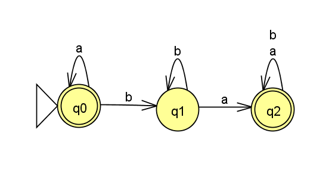
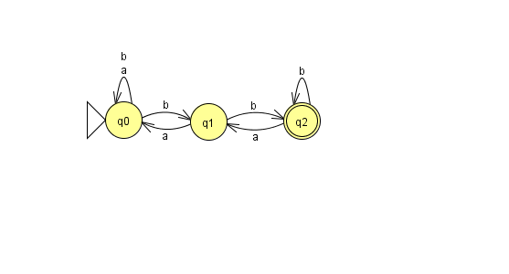
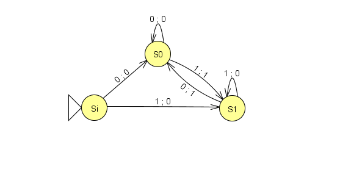
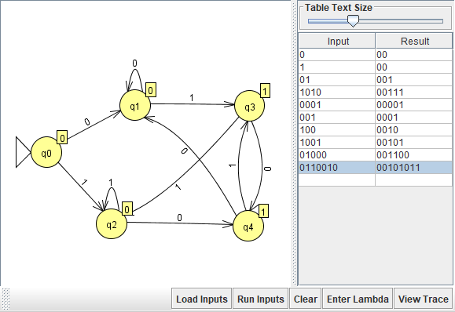
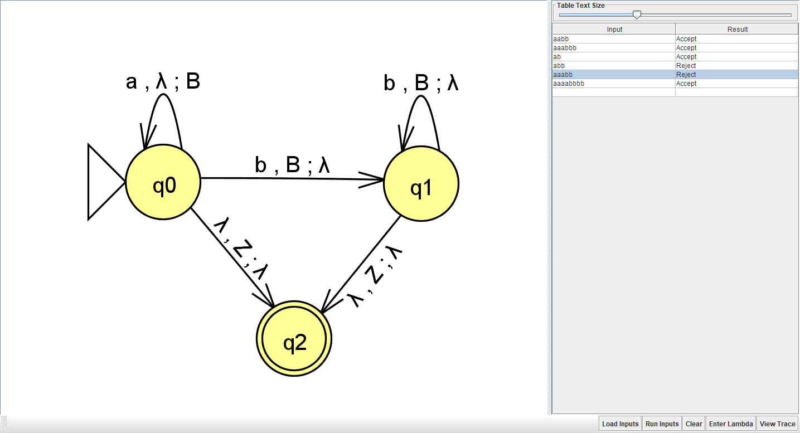

# Autômatos.

## O que é um autômato?
O termo autômato se refere a qualquer mecanismo capaz de se auto operar ou que segue uma sequência de passos internos. Os autômatos, na computação, são máquinas abstratas capazes de computar inputs e entregar um output. Máquinas de Estados funcionam como pequenos e extremamente simples computadores, servindo de modelo para entender o que pode ser "computável" ou não.

Os inputs dos autômatos são chamados de Linguagens e se trata de uma string: "aabb", "1010" ou coisa parecida.

# Modelos de autômatos realizados:

#### DFA (Deterministic Finite Automata - Autômato Finito Determinístico)

#### NFA (Non-Deterministic Finite Automata - Autômato finito não-determinístico)

#### Mealy Machines (Máquina de Mealy)

#### Moore Machines (Máquina de Moore)

#### Pushdown Automata (Autômato pilha)

# Modelos que restam:

#### Turing Machine (Máquina de Turing)
#### Multi-Tape Turing Machine (Máquina de Turing de fita multipla)
#### Turing Machine With Building Blocks (Máquina de Turing com blocos de construção)

# Outros presentes no JFLAP:

#### Grammar (Grámatica)
#### L-System
#### Regular Expression
#### Regular Pumping Lemma
#### Context-Free Pumping Lemma

O modelo dos autômatos foram feitos utilizando a ferramenta JFLAP.

A ideia inicial e o código inicial foi pego vídeo: https://www.youtube.com/watch?v=32bC33nJR3A&t=261s do canal ComputerPhile. Modelo do DFA e NFA foi realizado pelo professor Thorsten Altenkirch da universidade de Nottingham.